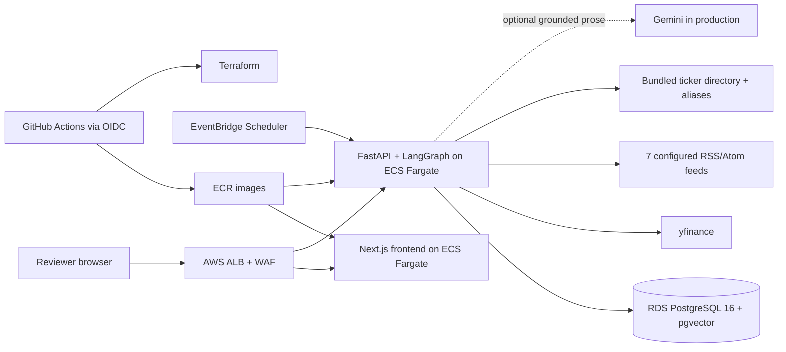

# Artha

Artha is a reviewer-facing research workspace for Indian equities. It lets an investor follow NSE/BSE symbols, build a durable research memory, ask grounded questions, and inspect the evidence behind each answer. It is a research demonstration: it does not place trades, generate buy/sell instructions, or predict prices.

**Deployed application:** `https://palani.cloud`
**Deterministic reviewer route:** `https://palani.cloud/demo`

## Reviewer Quick Start

1. Open `/demo`. This route is deterministic, network-independent, and does not change production state.
2. Try the exact starter questions:
   - `What kind of investor am I?`
   - `Compare RELIANCE and TCS.`
   - `Which followed company best fits my profile?`
   - `Give me a cited risk summary for RELIANCE.`
   - `What changed this week for RELIANCE?`
3. Follow another company, such as `INFY` or `HDFCBANK`, and repeat the comparison.
4. Open the evidence rail to inspect cited sources, source tiers, graph facts, and the indexed universe.
5. To test production authentication, use Google OIDC at the public root. Authenticated conversations and notes persist; demo mode remains isolated and deterministic.

## What Is Implemented

- Live mode uses `yfinance` for quotes and fundamentals plus seven configured, rate-limited RSS/Atom feeds covering Economic Times, Moneycontrol, LiveMint, Business Standard, and SEBI. It does **not** directly ingest NSE/BSE filings.
- A bundled deterministic ticker directory supports NSE and BSE autocomplete, company names, and search-only aliases. It is a manually updated directory, not a live exchange security master.
- PostgreSQL 16 with `pgvector` stores documents, cached embeddings, source metadata, graph facts, followed stocks, conversations, notes, and investor memory.
- The LangGraph flow extracts memory, retrieves pgvector candidates, applies deterministic ticker/recency/persona filters, composes citations, optionally rewrites prose with Gemini, and runs a grounding guard.
- Source tiers distinguish `primary`, `company`, `secondary`, and `contextual` evidence. Retrieved claims retain source IDs and citations.
- Broad questions search the followed/indexed universe. Ticker questions stay scoped to the active company. Bounded on-demand ingestion may index only the small number of directory candidates needed for a question; it is not unrestricted web search.
- Google OIDC, opaque server-side sessions, ownership checks, persisted conversations/notes, and server-side admin controls are enabled in production.
- The production path has AWS WAF rate limits, encrypted private RDS, one-day automated backups compatible with the intended RDS Free Tier posture, deletion protection, and final snapshots.
- Gemini is enabled in production by setting the GitHub production variable `AI_PROVIDER=gemini` and providing `GEMINI_API_KEY`. The default remains deterministic local generation when it is not enabled or unavailable.

## Architecture



Request flow: `memory -> retrieve -> deterministic rank/filter -> compose citations -> optional Gemini rewrite -> grounding guard`. The guard returns `I don't have that in the ingested data.` when the retrieved evidence cannot support a claim. Ingestion uses canonical URLs, content hashes, unique constraints, cached embeddings, and per-ticker PostgreSQL advisory locks for idempotency.

## Challenge Requirement Mapping

| Requirement | Implementation evidence |
| --- | --- |
| Indian-equity research | NSE/BSE follow flows, bundled directory, yfinance fundamentals, configured Indian financial feeds |
| Personalized research | Persisted investor persona, conversation context, notes, deterministic ranking against risk/dividend/debt/sector preferences |
| Grounded answers | pgvector retrieval, source IDs, source tiers, graph facts, citation rail, independent grounding guard |
| Safe bounded scope | Followed/indexed universe, bounded on-demand candidate ingestion, no unrestricted web search or filing claim |
| Usable demo | Deterministic `/demo`, exact starter questions, sample profile, no production state changes |
| Production readiness | ECS Fargate, ALB/WAF, RDS PostgreSQL, Secrets Manager, health/readiness checks, EventBridge refresh, GitHub OIDC CI/CD |
| Access and administration | Google OIDC, opaque secure sessions, ownership-scoped mutations, server-side `ADMIN_EMAILS` controls |

## Repository Map

```text
app/                    Next.js workspace and API client
backend/app/            FastAPI, LangGraph, ingestion, auth, repositories
backend/alembic/        PostgreSQL/pgvector migrations
backend/tests/          Backend unit and integration tests
e2e/                    Playwright critical-flow tests
infra/                  AWS Terraform stack and infrastructure README
.github/workflows/      CI and main-branch deployment
```

## API Surface

Canonical routes use `/api/v1`; compact `/api/*` aliases remain for the frontend.

| Method | Path | Purpose |
| --- | --- | --- |
| `GET` | `/health`, `/health/live` | Liveness |
| `GET` | `/health/ready` | Database, migrations, and pgvector readiness |
| `GET` | `/api/v1/tickers/search?q=...` | Search bundled tickers, names, aliases, and exchange |
| `GET` | `/api/v1/auth/google/config` | OIDC configuration status |
| `GET` | `/api/v1/auth/google/login` | Start Google OIDC |
| `GET` | `/api/v1/auth/google/callback` | Validate state/nonce and create session |
| `GET` | `/api/v1/auth/me` | Current user |
| `POST` | `/api/v1/auth/logout` | Revoke session |
| `GET/PATCH` | `/api/v1/persona` | Read/update investor memory |
| `GET` | `/api/v1/stocks` | Followed stocks |
| `POST/DELETE` | `/api/v1/stocks/{ticker}/follow` | Follow or unfollow a ticker |
| `POST` | `/api/v1/stocks/{ticker}/ingest` | Refresh one ticker's evidence |
| `POST` | `/api/v1/refresh` | Refresh all followed tickers |
| `GET` | `/api/v1/sources?ticker=...` | Indexed evidence and source metadata |
| `GET` | `/api/v1/stocks/{ticker}/graph-facts` | Deterministic graph facts |
| `GET/POST` | `/api/v1/conversations` | List or create owned conversations |
| `PATCH` | `/api/v1/conversations/{conversation_id}` | Rename an owned conversation |
| `GET/POST` | `/api/v1/notes` | List or create owned research notes |
| `PATCH/DELETE` | `/api/v1/notes/{note_id}` | Update or delete an owned note |
| `POST` | `/api/v1/chat` | Run the grounded research graph |
| `GET` | `/api/v1/admin/users` | List users for server-side admins |
| `POST` | `/api/v1/admin/users/{user_id}/reset-profile` | Reset a user's persona |
| `POST` | `/api/v1/admin/users/{user_id}/reset-follows` | Reset a user's followed stocks |
| `DELETE` | `/api/v1/admin/users/{user_id}/conversations` | Delete a user's persisted conversations |

Inputs are schema-validated; authenticated mutations are ownership-scoped and rate-limited. Cookies are `HttpOnly`, `Secure`, and `SameSite=Lax` outside local demo mode.

## Local Setup

Prerequisites: Docker Compose, Node.js 22.13+, and Python 3.12+.

```bash
cp .env.example .env
# Set POSTGRES_PASSWORD and a 32+ character SESSION_SECRET.
docker compose up --build
docker compose exec backend alembic upgrade head
```

Open `http://localhost:3000`; the API is at `http://localhost:8000` and Swagger UI is at `http://localhost:8000/docs`. Local defaults use demo auth and deterministic data; no model key is required. For a no-database backend demo, leave `DATABASE_URL` unset. Production requires the database and readiness checks.

## Verification

```bash
npm ci
npm run lint
npm run typecheck
npm test
npm run build:aws
npm run test:e2e
npm audit --omit=dev --audit-level=high

cd backend
.venv/bin/ruff check .
.venv/bin/mypy app
.venv/bin/pytest --cov=app --cov-report=term-missing --cov-fail-under=80
.venv/bin/pip-audit -r requirements.txt

cd ../
terraform -chdir=infra fmt -check -recursive
terraform -chdir=infra init -backend=false
terraform -chdir=infra validate
terraform -chdir=infra/bootstrap init -backend=false
terraform -chdir=infra/bootstrap validate
```

CI runs frontend, backend, Playwright, Terraform, dependency-audit, and Linux/amd64 container gates. The backend coverage gate is 80%.

## AWS and CI/CD

Terraform provisions a two-AZ VPC, ALB path routing, separate frontend/backend ECS Fargate services, ECR, encrypted non-public RDS PostgreSQL 16, Secrets Manager, CloudWatch, EventBridge scheduled ingestion, least-privilege runtime roles, and regional WAF rate limits for OAuth, chat, and narrow mutation paths. The default challenge-sized configuration is one task per service, `db.t4g.micro`, 20 GiB encrypted gp3, no NAT gateway, and one-day RDS backup retention. AWS charges still apply for ALB, Fargate, RDS, public IPv4, WAF, logs, and transfer.

On `main`, GitHub Actions assumes a scoped AWS role through OIDC, builds and scans commit-SHA images, writes runtime secrets to Secrets Manager, runs migrations as an ECS task, applies Terraform, waits for service stability, and smoke-tests the frontend plus liveness/readiness and OAuth configuration routes. Set `AI_PROVIDER=gemini` as a GitHub production variable to enable Gemini; the key remains a secret.

See [`infra/README.md`](infra/README.md) for bootstrap, variables, rollback, and operational commands.

## Responsible Use and Boundaries

Artha is not SEBI-registered investment advice. Data may be delayed, incomplete, syndicated, or unavailable. The seven configured feeds and yfinance are not a complete primary-source record, and the application does not directly ingest NSE/BSE filings. Verify exchange data, company disclosures, and primary filings independently.

No trading is supported: Artha never executes trades, connects to a brokerage for execution, gives a guaranteed outcome, or predicts a future price. "Best fit" and similar responses are bounded research rankings over the followed/indexed evidence and stored investor preferences, not recommendations or promises.

The current challenge-scope identity is `(ticker)` with NSE/BSE as an attribute. It does not store simultaneous NSE and BSE listings of the same normalized symbol as separate holdings; a production brokerage integration should use `(ticker, exchange)` or an exchange-issued instrument ID.
