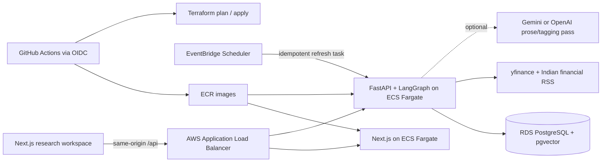

# Artha — contextual Indian-equity research

Artha is a personal research chief of staff for NSE and BSE equities. It follows
Indian tickers, ingests fundamentals and financial news, learns an investor's
preferences, and returns grounded research with source citations and INR-only
figures.

The project is deliberately deployable rather than localhost-only: the frontend
and API are containerized, PostgreSQL/pgvector and the AWS runtime are defined in
Terraform, and a main-branch GitHub Actions workflow builds immutable images,
runs migrations, rolls out ECS services, and smoke-tests the public application.

> **Current repository status:** the full application and deployment automation
> are implemented and deployed at `https://palani.cloud`. Cloud-console and
> CI screenshots should be attached to the submission separately with secret
> values hidden.

## What reviewers can exercise

- Sign in with Google OIDC, or use deterministic demo auth locally.
- Follow NSE/BSE symbols such as `RELIANCE`, `TCS`, and `HDFCBANK`.
- Remove a followed equity with a confirmation step; the watchlist and active
  research thread update immediately.
- Ingest deduplicated fundamentals and recent Indian-market news from seven free RSS/Atom feeds spanning Economic Times, Moneycontrol, LiveMint, Business Standard, and SEBI.
- Ask ticker questions and inspect the exact sources behind each answer.
- Teach the agent a risk, dividend, debt, sector, and time-horizon persona in
  chat or edit that memory explicitly.
- Request personalized ideas ranked with testable algorithms before generation.
- Receive a safe “I don't have that in the ingested data” response when the
  retrieved evidence cannot support a claim.
- New authenticated users get a six-step first-research tutorial, clickable
  question starters, and an investor-memory handoff before they begin.
- Broad questions such as “compare” and “which followed company fits me?” are
  routed across the followed universe; ticker-specific questions stay scoped to
  the active company. The evidence rail refreshes after every follow/ingest and
  highlights sources cited by the latest answer.
- Starter questions are generated from the active/followed universe rather than
  hard-coded to a particular company. “What changed this week?” prioritizes the
  newest retrieved news and states clearly when no matching news exists.
- Signed-in workspaces automatically refresh all followed tickers every two
  minutes and refresh again when the browser returns to the foreground. The
  manual Refresh control remains available as an explicit “refresh now” action.

The default `demo` data provider is deterministic, free, and network-independent
for evaluation. `MARKET_DATA_PROVIDER=live` enables yfinance quotes/fundamentals
plus rate-limited configured RSS feeds. The UI labels sample versus live state so
fixture data is never presented as a live market feed.

The Terraform production stack explicitly sets `MARKET_DATA_PROVIDER=live`, so
the deployed application retrieves live quote/fundamental data and configured RSS
coverage. The deterministic provider remains available for local tests and demos.

## Architecture



The LangGraph request path separates work that benefits from language models
from work that does not:

1. Extract persona updates from the conversation and persist a versioned vector.
2. Retrieve pgvector candidates, then rank/filter them deterministically against
   ticker, recency, debt, dividend, risk, and sector constraints.
3. Compose a cited draft from the selected source IDs.
4. Optionally improve prose with an LLM while treating retrieved text as
   untrusted data.
5. Run the grounding guard; unsupported numeric or qualitative claims become a
   safe fallback instead of reaching the user.

The deployed default remains deterministic and grounded (`AI_PROVIDER=local`)
until a provider key is deliberately enabled. The backend supports optional
OpenAI and Gemini prose/tagging passes; either provider is wrapped by a
claim-preserving rewrite check and the independent grounding guard, with local
fallback when a key is absent or a quota is exceeded. Gemini uses the stable
`gemini-2.5-flash` model by default and its API key is stored only in Secrets
Manager/GitHub environment secrets.

Ingestion uses normalized URLs, content hashes, a unique database constraint,
cached embeddings, and a per-ticker PostgreSQL advisory lock. Manual and
scheduled jobs can therefore overlap without double-indexing articles or
corrupting rolling sentiment.

## Repository map

```text
app/                    Next.js workspace, API client, design system
backend/app/            FastAPI, LangGraph, ingestion, auth, repositories
backend/alembic/        pgvector schema and HNSW index migration
backend/tests/          unit and API integration tests
e2e/                    Playwright critical-user-flow tests
infra/                  production AWS Terraform stack
infra/bootstrap/        remote state and GitHub OIDC bootstrap
.github/workflows/      CI quality gates and main-branch deployment
scripts/                migration and manual ECS deployment helpers
```

## Run locally

### One-command stack

Prerequisites: Docker with Compose.

```bash
cp .env.example .env
# Replace POSTGRES_PASSWORD and SESSION_SECRET in .env.
docker compose up --build
docker compose exec backend alembic upgrade head
```

Open `http://localhost:3000`. The API is at `http://localhost:8000`, its docs at
`http://localhost:8000/docs`, and PostgreSQL at `localhost:5432`.

The local stack intentionally uses demo auth and deterministic research data
unless the corresponding provider settings are changed. No paid model key is
required.

### Run services directly

Use Node.js 22.13+ and Python 3.12+.

```bash
npm ci
npm run dev:aws
```

In a second shell:

```bash
cd backend
python3 -m venv .venv
.venv/bin/pip install -r requirements-dev.txt
cp .env.example .env
.venv/bin/uvicorn app.api:app --reload --port 8000
```

For an in-memory demo, leave `DATABASE_URL` unset. Production refuses this
fallback and its readiness endpoint verifies connectivity, the migration, and
the pgvector extension.

## API surface

| Method | Path | Purpose |
| --- | --- | --- |
| `GET` | `/health` or `/health/live` | Shallow container liveness |
| `GET` | `/health/ready` | Database, migration, and pgvector readiness |
| `GET` | `/api/v1/auth/google/config` | OAuth configuration status |
| `GET` | `/api/v1/auth/google/login` | Start Google OIDC |
| `GET` | `/api/v1/auth/google/callback` | Validate state/nonce and create session |
| `GET` | `/api/v1/auth/me` | Current authenticated user |
| `POST` | `/api/v1/auth/logout` | Revoke current session |
| `GET/PATCH` | `/api/v1/persona` | Read or update investor memory |
| `GET` | `/api/v1/stocks` | List followed stocks |
| `POST` | `/api/v1/stocks/{ticker}/follow` | Follow and idempotently ingest a ticker |
| `DELETE` | `/api/v1/stocks/{ticker}/follow` | Remove a ticker from the current watchlist |
| `POST` | `/api/v1/stocks/{ticker}/ingest` | Refresh one ticker's fundamentals and news |
| `POST` | `/api/v1/refresh` | Automatically refresh every followed ticker and return hydrated quotes |
| `GET` | `/api/v1/sources?ticker=...` | List indexed sources for a ticker |
| `POST` | `/api/v1/chat` | Run the contextual, grounded graph |

Compatibility endpoints under `/api/*` support the frontend's compact contract.
Inputs are schema-validated, authenticated mutations are rate-limited, session
identifiers are opaque and hashed at rest, and cookies are `HttpOnly`, `Secure`,
and `SameSite=Lax` outside the local demo.

## Verification

```bash
# Frontend
npm run lint
npm run typecheck
npm test
npm run build:aws
npm run test:e2e
npm audit --audit-level=high

# Backend
cd backend
.venv/bin/ruff check .
.venv/bin/mypy app
.venv/bin/pytest --cov=app --cov-report=term-missing --cov-fail-under=80
.venv/bin/pip-audit -r requirements.txt

# Infrastructure
terraform -chdir=infra fmt -check -recursive
terraform -chdir=infra init -backend=false
terraform -chdir=infra validate
```

CI runs these gates, both Linux/amd64 container builds, the Playwright suite,
and Terraform bootstrap validation. The backend test suite enforces at least 80%
coverage and includes grounding, adversarial source content, persona learning,
ranking, BSE/NSE normalization, failed-provider fallback, ingestion idempotency,
and concurrent-ingestion cases.

## Google OAuth setup

1. Create a Google Cloud project and an OAuth 2.0 **Web application** client.
2. Keep the consent screen in testing mode and add these required test users:
   - `harisankar@sentellent.com`
   - `naga@sentellent.com`
3. Set the authorized redirect URI to
   `https://YOUR_DOMAIN/api/v1/auth/google/callback`.
4. Store `GOOGLE_CLIENT_ID`, `GOOGLE_CLIENT_SECRET`, and a random 32+ character
   `SESSION_SECRET` in the GitHub `production` environment. Never commit them.

Production Terraform requires an HTTPS `public_base_url` and regional ACM
certificate. Plain-HTTP OAuth deployment is rejected because secure cookies and
the authorization-code flow must not be exposed over HTTP.

## AWS and CI/CD

The challenge-sized default uses one task per service, a `db.t4g.micro`, 20 GiB
of encrypted storage, no NAT gateway, and short CloudWatch retention. AWS will
still charge for ALB, Fargate, RDS, public IPv4, logs, and data transfer; set a
budget before applying.

### 1. Bootstrap state and GitHub OIDC once

```bash
cp infra/bootstrap/terraform.tfvars.example infra/bootstrap/terraform.tfvars
# Set github_repository and account-specific values.
terraform -chdir=infra/bootstrap init
terraform -chdir=infra/bootstrap plan
terraform -chdir=infra/bootstrap apply
terraform -chdir=infra/bootstrap output
```

The bootstrap role trusts only the configured repository's protected
`production` GitHub environment. No long-lived AWS access keys are stored in
GitHub.

### 2. Configure the GitHub production environment

Repository/environment variables:

- `AWS_REGION` (normally `ap-south-1`)
- `AWS_ROLE_ARN`
- `TF_STATE_BUCKET` and `TF_STATE_KEY`
- `PROJECT_NAME`
- `ACM_CERTIFICATE_ARN`
- `PUBLIC_BASE_URL`, such as `https://stocks.example.com`

Environment secrets:

- `SESSION_SECRET` (required)
- `GOOGLE_CLIENT_ID` and `GOOGLE_CLIENT_SECRET` (required for reviewer login)
- `OPENAI_API_KEY` (optional)
- `GEMINI_API_KEY` (optional; set the `AI_PROVIDER` repository variable to `gemini` to enable it)

Protect the `production` environment so only `main` can deploy. Point the public
domain at the ALB before testing Google OAuth.

### 3. Push to main

The deployment workflow:

1. Runs every CI quality gate.
2. Assumes the scoped deploy role through GitHub OIDC.
3. Builds and scans commit-SHA frontend/backend images in ECR.
4. Registers the new backend revision without shifting live traffic.
5. runs `alembic upgrade head` as a one-off ECS task and checks its exit code.
6. Applies the saved Terraform plan and waits for ECS stability.
7. Smoke-tests the UI, liveness/readiness, and same-origin OAuth config route.

See `infra/README.md` for resource details, optional private-subnet/NAT mode,
manual deployment, rollback, and operational commands.

## Submission evidence checklist

Capture evidence only after a real successful deployment:

- Public HTTPS app showing a signed-in reviewer, followed ticker, personalized
  answer, citation panel, and safe unsupported-data response.
- GitHub Actions `CI` jobs and `Deploy production` workflow passing for the same
  commit SHA.
- ECS cluster with both services stable and ALB target groups healthy.
- RDS PostgreSQL instance, ECR images/scans, EventBridge ingestion schedule, and
  Secrets Manager entries with secret values hidden.
- Google consent-screen test users showing both Sentellent addresses.

Submit the GitHub repository link, live HTTPS URL, and those screenshots at
[the Sentellent submission form](https://forms.gle/qWxabTxLjEkJ2LcEA).

## Responsible-use note

Artha is a research demonstration, not SEBI-registered investment advice. Data
can be delayed or incomplete; users should verify primary filings and exchange
data before making financial decisions.

One deliberate challenge-scope boundary remains: a company symbol is the stock
identity, with NSE/BSE stored as an attribute. A user can select either exchange,
and refreshes preserve it, but simultaneous NSE and BSE listings with the same
normalized symbol are not stored as separate holdings. A production brokerage
integration should migrate the key to `(ticker, exchange)` or an exchange-issued
instrument ID.
